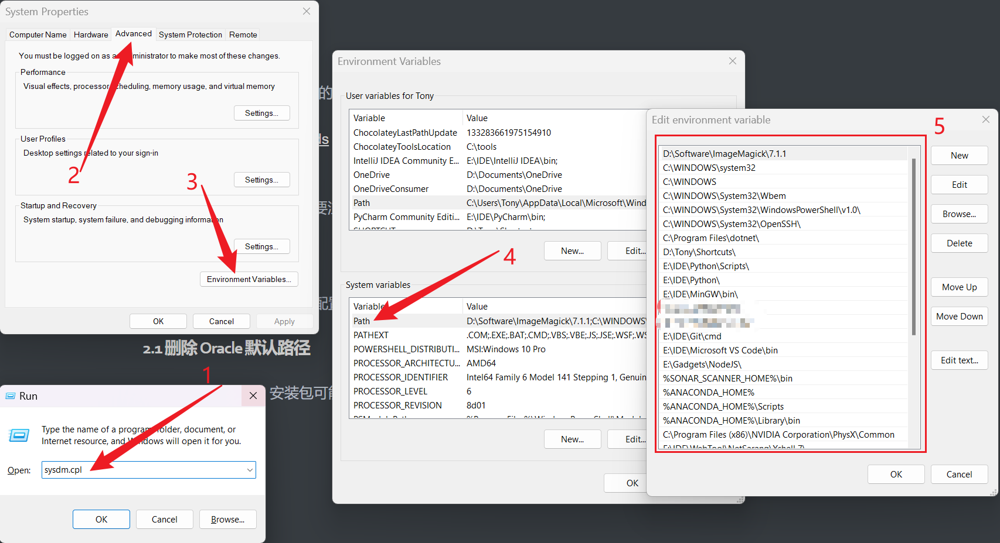
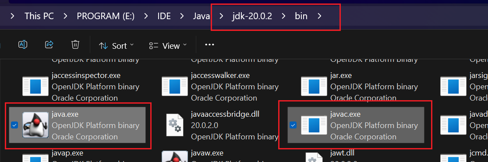
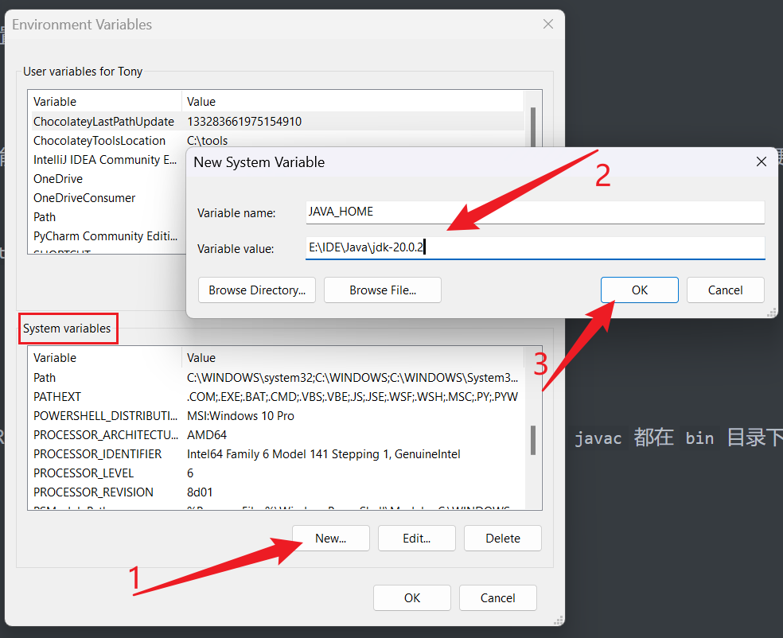
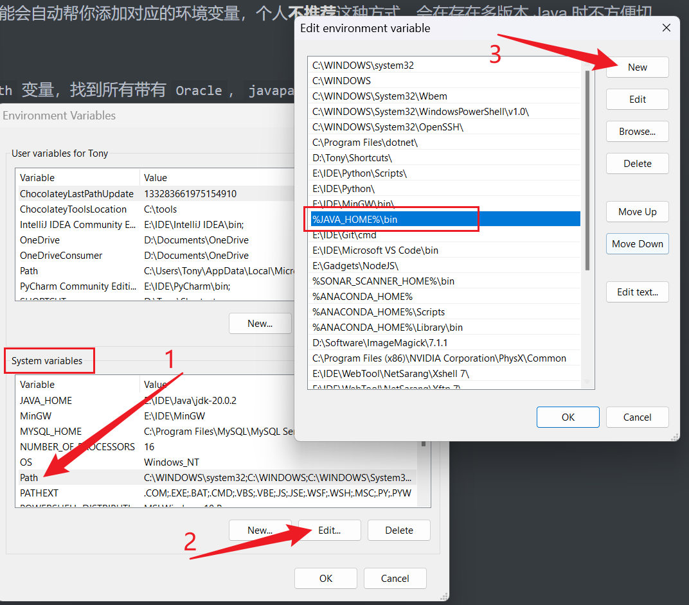

# Java 环境配置

!!! Info
这篇文章会详细介绍如何配置 Java 环境，包括 JDK，JRE 与 CLASSPATH，从而可以在命令行编译运行 Java。

## 1. 安装 JDK

首先，在官网找到自己心仪的 JDK 版本，下载对应的 JDK。安装时，可以自行更改路径。

- Oracle: [Java Downloads](https://www.oracle.com/java/technologies/downloads/)

平台评测机默认使用 OpenJDK 17，因此更推荐 JDK 17，不过安装多个 Java 版本是完全可以的。

!!! Note
在 Oracle 官网下载会可能需要注册账号，绕不开的话注册即可。

---

## 2. 配置环境变量

安装好 Java 后，我们需要配置 Java 相关的环境变量。

!!! Warning
以下所有环境变量均为**系统环境变量**。

### 2.1 删除 Oracle 默认路径

Oracle 提供的 JDK 安装包可能会自动帮你添加对应的环境变量，个人**不推荐**这种方式，可以删除默认添加的环境变量。

打开环境变量界面，编辑 `Path` 变量，找到所有带有 `Oracle`，`javapath` 之类字样的值，删除即可。



### 2.2 添加 JDK 与 JRE 路径

下载 JDK 时，会自动包括 JRE，但是高版本的 JDK 已经**没有**单独的 `jre` 目录了，`java` 与 `javac` 都在 `bin` 目录下，因此**网上很多文章都具有一定的误导性**，是没有必要再单独下载 JRE 的。



首先，我们添加 `JAVA_HOME` 变量，如下，具体路径改为你的安装路径即可，路径结尾不加 `\`，从而之后的拼接更清晰。



接下来，在 `Path` 变量里添加 Java 路径，如下。



### 2.3 添加 CLASSPATH

与 `JAVA_HOME` 变量添加方式相同，我们需要在系统环境变量中添加 `CLASSPATH`，具体值如下，注意开头的 `.`。

```
.;%JAVA_HOME%\lib\dt.jar;%JAVA_HOME%\lib\tools.jar;
```

### 2.4 测试 Java 环境

配置好环境变量后，打开命令行，输入如下命令测试，如果两条命令均无报错，且**版本一致**，那么恭喜你（大概率）完成了 Java 环境的配置。

```powershell
> java -version
openjdk version "20.0.2" 2023-07-18
OpenJDK Runtime Environment (build 20.0.2+9-78)
OpenJDK 64-Bit Server VM (build 20.0.2+9-78, mixed mode, sharing)
> javac -version
javac 20.0.2
```

!!! Error
低版本 `java` 无法运行高版本 `javac` 编译出的字节码，因此最好保证二者版本相同。

你也可以用 `where` 命令查看 `java` 和 `javac` 的安装位置，注意 `where` 要带 `.exe` 后缀，否则可能无法正常输出。

```powershell
> where.exe java
E:\IDE\Java\jdk-20.0.2\bin\java.exe
> where.exe javac
E:\IDE\Java\jdk-20.0.2\bin\javac.exe
```

---

## 3. Java 的命令行编译与运行

我们通过一个简单的示例来演示如何在命令行中编译与运行 Java。

!!! Info
开始之前，请确保你通过了 [2.4](#2-4-测试-Java-环境) 的测试。

### 3.1 无包名

对于没有包名的程序，我们书写以下 Java 代码，位于 `src\` 目录下。

```java
public class Main {
	public static void main(String[] args) {
		System.out.println("May the Force be with you!");
	}
}
```

在命令行中，通过 `javac` 进行编译，如果没有输出，表示编译成功，并且可以看到目录下多了同名的 `.class` 文件。

```powershell
src> javac Main.java
```

> 如果输出中文出现乱码报错，可以添加 `-encoding` 参数更改默认编码，如下。
>
> ```powershell
> src> javac Main.java -encoding UTF-8
> ```

接下来，通过 `java` 命令运行生成的字节码。

```powershell
src> java Main
May the Force be with you!
```

如果一切正常，那么恭喜你，你真正完成了 Java 环境的配置！🥳

### 3.2 有包名

利用包管理 Java 代码是好的编程习惯，因此推荐大家多多了解。对于有包名的情况，我们需要在运行时加上包名。我们的程序如下，将其放在 `src/top/tony/` 目录下，`src/` 为项目根目录，包名为 `top.tony`。

```java
package top.tony;

public class Main {
	public static void main(String[] args) {
		System.out.println("Greetings from inside of the package!");
	}
}
```

现在，编译和运行的命令如下，编译与无包名相同，指名 `.java` 路径即可，运行时需要在项目根目录执行 `java` 命令，并指定包名。

```powershell
src> javac .\top\tony\Main.java
src> java top.tony.Main
Greetings from inside of the package!
```

---

## Troubleshoot

### 1. 无法找到主类

配置过程中，一个常见的问题是 `Error: Could not find or load main class ...`，关于该错误，可以参考这一篇文章。

- [Java – “Could Not Find or Load Main Class” Error](https://www.baeldung.com/java-could-not-find-load-main-class)

### PS:

如果还是有问题，可以自行搜索解决方案，实在无法解决可以联系助教寻求帮助。🫡
